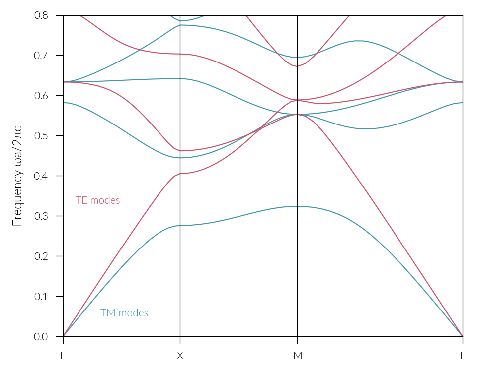

=============
Documentation
=============

.. only:: html

  .. raw:: html

    

  .. include:: ../README.rst
    :end-before: inclusion-marker-badges

  .. raw:: html

    

Welcome! This is the documentation for ``protis`` v |release|, last updated on |today|.

``protis`` is a `Python <http://python.org/>`_ package that solves for eigenmodes 
of Photonic crystals using the Plane Wave Expansion Method (PWEM).

The code of the project is `on Gitlab <https://gitlab.com/protis/protis>`_

Features
========

* Automatic differentiation.
* GPU acceleration.

.. toctree::
   :maxdepth: 2
   :hidden:

   installation
   api
   biblio
   license
